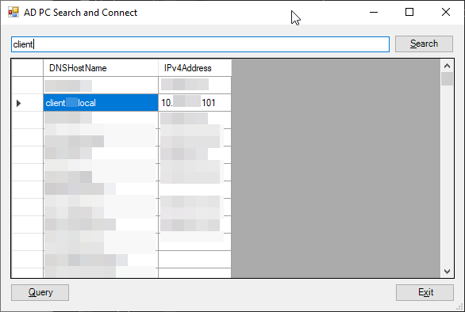

# AD PC Search and Connect

Предельно простая утилита, которая позволяет выгрузить список ПК из Active Directory и подключиться к любому из них

## Требования

* Powershel 3+ (.NET 4+)
* [PowerShell Active Directory module](https://4sysops.com/wiki/how-to-install-the-powershell-active-directory-module/)

## Возможности

* Настройки во внешнем файле
  * Можно задать своё имя
  * Указать один или несколько контроллеров домена (из разных лесов) из каждого будут считаны ПК (дольше)
  * Можно указать свою команду для подключения (по умолчанию используется удаленный ассистент)
* Портативная
* Отображение списка ПК из FQDN-имени и IP
* Поиск по списку

## Использование
0. [Скачать](https://github.com/soulruins/AD-PC-Search-and-Connect/releases/latest)
1. Запустить рядом с файлом настроек (`settings.json` предварительно прописав свои параметры)
2. Нажать <kbd>Query</kbd> для инициализации выгрузки списка ПК
3. При необходимости использовать поиск
4. Для подключения к хосту достаточно **дважды кликнуть мышкой по имени или IP**
